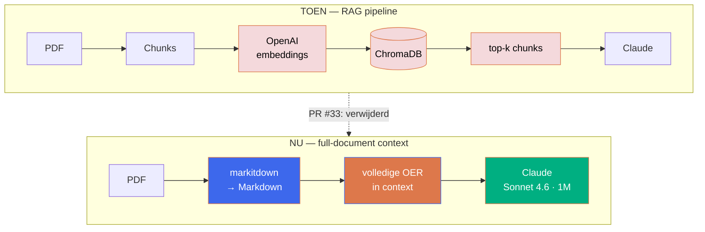

<!-- TITELSLIDE (Slide1.PNG) -->
<div style="position: absolute; top: 0; left: 0; width: 100%; height: 100%; z-index: -1;">
  
</div>

<div class="title-center">

# Validatie Samenwijzer

## Hoe we van een vector store naar full-document context kwamen

<div class="mt-2 title-subtitle">
<strong>CEDA</strong> - Centre for Educational Data Analytics
</div>
</div>

<!--
Welkom. 5-10 minuten over een MBO-app waarin student en mentor met hun OER chatten.
De nadruk ligt niet op het product, maar op HOE we tewerk gingen: we begonnen met de
"juiste" oplossing (RAG) en hebben die er onderweg weer uitgesloopt.
-->

---

<!-- AGENDA (Slide2.PNG) — tekst rechts -->
<div style="position: absolute; top: 0; left: 0; width: 100%; height: 100%; z-index: -1;">
  
</div>

<div style="margin-left: 50%; padding-left: 2rem; height: 100%; display: flex; flex-direction: column; justify-content: center;">

## Agenda

<div style="font-size: 1rem; line-height: 2; margin-top: 1rem;">

- Het probleem: chatten met een juridisch document
- Iteratie 1 — klassieke RAG
- Waar het schuurde
- Het inzicht
- Iteratie 2 — full-document context
- Wat het opleverde & wat we leerden

</div>
</div>

---

<!-- PROBLEEM (Slide3.PNG) -->
<div style="position: absolute; top: 0; left: 0; width: 100%; height: 100%; z-index: -1;">
  
</div>

<div style="position: absolute; inset: 0; display: flex; flex-direction: column; justify-content: center; padding: 2rem 4rem; z-index: 1;">

# Het probleem

<div class="grid grid-cols-2 gap-6" style="margin-top: 1rem; align-items: center;">
<div style="font-size: 0.95rem; line-height: 1.8;">

- MBO-student en mentor willen een **betrouwbaar antwoord** uit hun OER
- De OER is een **juridisch document** — een fout antwoord heeft gevolgen
- Eis: elk antwoord **verifieerbaar**, met sectie, pagina én woordelijk citaat
- Per instelling, opleiding en cohort een ander document

</div>
<div style="display: flex; justify-content: center;">
  
</div>
</div>
</div>

<!--
De citatieplicht is cruciaal: het is geen chatbot die "iets" zegt, maar iets dat naar
de bron moet kunnen wijzen. Onthoud deze eis — die heeft uiteindelijk de architectuur bepaald.
-->

---

<!-- AANPAK IN ÉÉN ZIN (Slide3.PNG) — highlight -->
<div style="position: absolute; top: 0; left: 0; width: 100%; height: 100%; z-index: -1;">
  
</div>

<div style="position: absolute; inset: 0; display: flex; flex-direction: column; justify-content: center; align-items: center; text-align: center; padding: 3rem 5rem; z-index: 1;">

<div style="font-family: 'Cooper Light BT', serif; font-size: 1.8rem; line-height: 1.5; color: #3D68EC;">
"Aanname → bouwen → meten → bijsturen.<br/>Niet vasthouden aan de eerste oplossing."
</div>

<div style="margin-top: 1.5rem; font-size: 0.9rem; color: #000;">— De rode draad van dit project</div>

</div>

---

<!-- HOOFDSTUK 1 (Slide14.PNG) — witte tekst -->
<div style="position: absolute; top: 0; left: 0; width: 100%; height: 100%; z-index: -1;">
  
</div>

<div style="position: absolute; inset: 0; display: flex; align-items: center; justify-content: center; padding: 0 4rem; z-index: 1;">
  <h1 style="color: #FFFFFF !important; font-size: 3rem; text-align: center;">Iteratie 1 — klassieke RAG</h1>
</div>

---

<!-- ITERATIE 1 DETAIL (Slide4.PNG) -->
<div style="position: absolute; top: 0; left: 0; width: 100%; height: 100%; z-index: -1;">
  
</div>

<div style="position: absolute; inset: 0; display: flex; flex-direction: column; justify-content: center; padding: 2rem 4rem; z-index: 1;">

# De voor de hand liggende keuze

<div class="grid grid-cols-2 gap-6" style="margin-top: 1rem; align-items: center;">
<div style="font-size: 0.95rem; line-height: 1.8;">

- **ChromaDB** als vector store
- **OpenAI-embeddings** voor de semantische zoektocht
- OER in **chunks** geknipt, top-k opgehaald per vraag
- Het standaard RAG-recept — zo "hoort" het toch?

</div>
<div style="display: flex; justify-content: center;">
  
</div>
</div>
</div>

<!--
Dit was niet naïef — dit is het boekenrecept voor "chat met je documenten" in 2024/2025.
Embeddings + vector DB + retrieval. We hebben het netjes gebouwd en het wérkte ook.
-->

---

<!-- WAAR HET SCHUURDE (Slide5.PNG) -->
<div style="position: absolute; top: 0; left: 0; width: 100%; height: 100%; z-index: -1;">
  
</div>

<div style="position: absolute; inset: 0; display: flex; flex-direction: column; justify-content: center; padding: 2rem 4rem; z-index: 1;">

# Waar het schuurde

<div style="font-size: 0.95rem; line-height: 1.9; margin-top: 1rem;">

- **Chunks knippen context kapot** — een kerntaak verwijst naar een examenplan drie pagina's verderop
- **Citaten werden onbetrouwbaar** — het opgehaalde fragment dekte de claim niet altijd
- **Tweede API + tweede leverancier** — OpenAI-embeddings naast Claude
- **Extra bewegende delen** — vector store vullen, syncen, onderhouden
- Veel **complexiteit** voor 14 opleidingen × een handvol cohorten

</div>
</div>

<!--
De citatieplicht (slide 3) brak hier. Als je per claim een woordelijk citaat met pagina
moet geven, en je hebt alleen losse chunks gezien, dan kun je dat simpelweg niet garanderen.
Dat was het signaal om te stoppen en te heroverwegen — niet doorpolijsten.
-->

---

<!-- HET INZICHT (Slide6.PNG) — highlight + lamp -->
<div style="position: absolute; top: 0; left: 0; width: 100%; height: 100%; z-index: -1;">
  
</div>

<div style="position: absolute; inset: 0; display: flex; flex-direction: column; justify-content: center; align-items: center; text-align: center; padding: 3rem 5rem; z-index: 1;">


<div style="font-family: 'Cooper Light BT', serif; font-size: 1.7rem; line-height: 1.5; color: #3D68EC;">
"Een OER is 20 tot 40 pagina's.<br/>Het 1M-tokenvenster van Sonnet 4.6 slikt dat in één keer."
</div>

<div style="margin-top: 1.2rem; font-size: 0.9rem; color: #000;">Waarom zoeken naar het juiste stukje als alles past?</div>

</div>

---

<!-- HOOFDSTUK 2 (Slide15.PNG) — witte tekst -->
<div style="position: absolute; top: 0; left: 0; width: 100%; height: 100%; z-index: -1;">
  
</div>

<div style="position: absolute; inset: 0; display: flex; align-items: center; justify-content: center; padding: 0 4rem; z-index: 1;">
  <h1 style="color: #FFFFFF !important; font-size: 3rem; text-align: center;">Iteratie 2 — full-document context</h1>
</div>

---

<!-- ITERATIE 2 DETAIL (Slide4.PNG) — code -->
<div style="position: absolute; top: 0; left: 0; width: 100%; height: 100%; z-index: -1;">
  
</div>

<div style="position: absolute; inset: 0; display: flex; flex-direction: column; justify-content: center; padding: 2rem 4rem; z-index: 1;">

# Geen retrieval, gewoon de hele OER

```python {1-3|5-7|all}
# 1. PDF → Markdown bij ingestie (markitdown, behoudt tabellen)
md = converteer_naar_markdown(pdf_pad)        # <stem>.md

# 2. Op chat-tijd: laad de VOLLEDIGE OER als context
tekst = laad_oer_tekst(oer_id)                # md → pdfplumber fallback
systeem = bouw_systeem(tekst)                 # cap: 500.000 tekens
```

<div style="font-size: 0.85rem; line-height: 1.6; margin-top: 0.8rem; color: #000;">
Geen chunking · geen embeddings · geen vector store. De OER staat volledig in de system prompt.
</div>
</div>

<!--
markitdown geeft veel schonere tekst dan kale pdfplumber-extractie, vooral bij tabellen
(examenplannen!). De fallback-keten zorgt dat het altijd iets oplevert. 500k tekens cap
is ruim genoeg voor één OER en houdt ons binnen het venster.
-->

---

<!-- DE OMSLAG — MERMAID TOEN VS NU (Slide5.PNG) -->
<div style="position: absolute; top: 0; left: 0; width: 100%; height: 100%; z-index: -1;">
  
</div>

<div style="position: absolute; inset: 0; display: flex; flex-direction: column; justify-content: center; padding: 1.5rem 3rem; z-index: 1;">

# De omslag — PR #33



</div>

<!--
PR #33, mei 2026: ChromaDB en de OpenAI-embeddings zijn er volledig uitgesloopt.
De roze nodes links verdwenen; rechts blijft een rechte lijn over. Minder code,
minder afhankelijkheden, minder dat stuk kan.
-->

---

<!-- DEMO — SCREENSHOT (Slide4.PNG) -->
<div style="position: absolute; top: 0; left: 0; width: 100%; height: 100%; z-index: -1;">
  
</div>

<div style="position: absolute; inset: 0; display: flex; flex-direction: column; justify-content: center; align-items: center; padding: 1rem 3rem; z-index: 1;">

<div style="font-size: 1.5rem; font-weight: 600; color: #DD784B; margin-bottom: 0.6rem;">Live: een verifieerbaar antwoord</div>


<div style="font-size: 0.85rem; line-height: 1.5; margin-top: 0.7rem; color: #000; text-align: center;">
De OER-assistent citeert <strong>woordelijk uit sectie 4.8</strong> — verifieerbaar, want het model ziet het hele document.
</div>
</div>

<!--
Demo van de student-OER-chat (Talland, opleiding MZG). De vraag over herkansing wordt
beantwoord met een letterlijk citaat uit de OER plus de sectie-aanduiding — precies de
juridische citatieplicht die met losse chunks niet te garanderen was. Eventueel hier
live de app tonen op poort 8503.
-->

---

<!-- WAT HET OPLEVERDE (Slide3.PNG) -->
<div style="position: absolute; top: 0; left: 0; width: 100%; height: 100%; z-index: -1;">
  
</div>

<div style="position: absolute; inset: 0; display: flex; flex-direction: column; justify-content: center; padding: 2rem 4rem; z-index: 1;">

# Wat het opleverde

<div class="grid grid-cols-3 gap-4" style="font-size: 0.9rem; line-height: 1.6; margin-top: 1rem;">
<div>

**Betrouwbaarder**

Het model ziet het hele document → woordelijke citaten mét paginanummer

</div>
<div>

**Simpeler**

Eén leverancier, geen vector store om te vullen of te syncen

</div>
<div>

**Robuuster**

Geen chunk-grenzen die context doorknippen of references missen

</div>
</div>

<div style="font-size: 0.85rem; line-height: 1.6; margin-top: 1.5rem; color: #000;">
Trade-off die we accepteren: meer tokens per vraag — opgevangen met prompt caching van de OER-context.
</div>
</div>

<!--
Eerlijk blijven: full-context is niet gratis. Je betaalt meer input-tokens per vraag.
Bij één document van ~40 pagina's en met prompt caching is dat ruim acceptabel, en het
weegt niet op tegen de winst in betrouwbaarheid en eenvoud.
-->

---

<!-- WAT WE LEERDEN (Slide3.PNG) — highlight -->
<div style="position: absolute; top: 0; left: 0; width: 100%; height: 100%; z-index: -1;">
  
</div>

<div style="position: absolute; inset: 0; display: flex; flex-direction: column; justify-content: center; align-items: center; text-align: center; padding: 3rem 5rem; z-index: 1;">

<div style="font-family: 'Cooper Light BT', serif; font-size: 1.8rem; line-height: 1.5; color: #3D68EC;">
"Het slimste retrieval-systeem<br/>is soms géén retrieval."
</div>

<div style="margin-top: 1.5rem; font-size: 0.95rem; color: #000; line-height: 1.8;">
Bouw het standaardrecept, maar meet of het je probleem écht oplost.<br/>
Groeiende modelcontext maakt gisteren's best practice vandaag overbodig.
</div>

</div>

---

<!-- AFSLUITSLIDE (Slide17.PNG) — geen tekst -->
<div style="position: absolute; top: 0; left: 0; width: 100%; height: 100%; z-index: -1;">
  
</div>

<!--
Afsluiter. Hier kun je de live demo openen: app op poort 8503, publieke OER-vraag-pagina,
en laten zien hoe het antwoord een woordelijk citaat met paginanummer teruggeeft.
Bedankt — vragen?
-->
